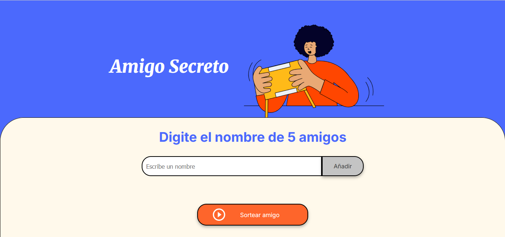
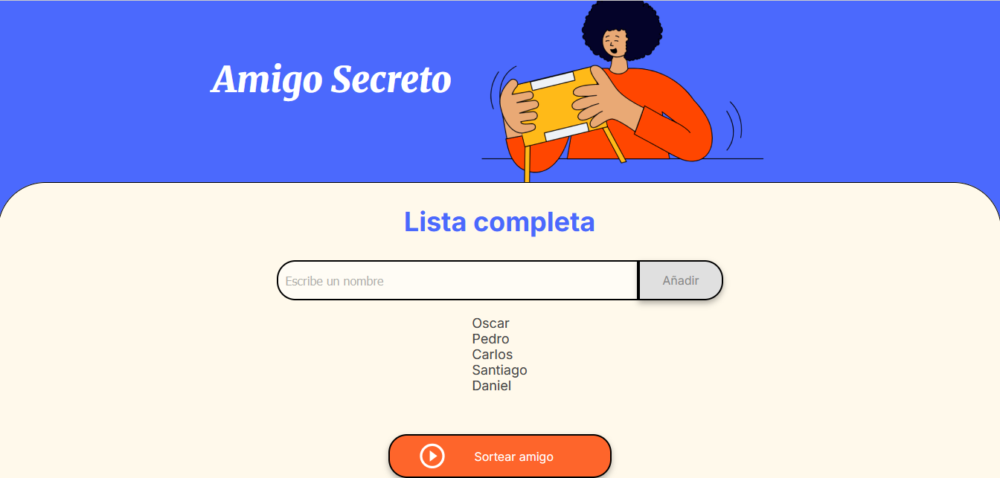
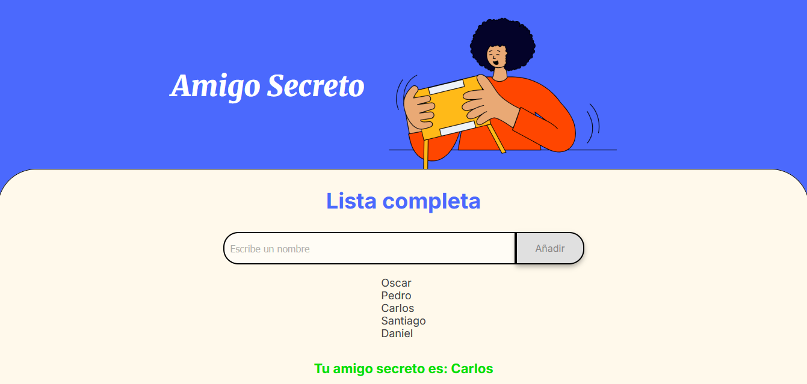

# 🎁 Amigo secreto

Bienvenido(a) a la web del **¡Challenge - Amigo Secreto!**

Esta web permite realizar de manera sencilla, rápida y divertida un sorteo a partir de una lista con el nombre de cinco de tus mejores amigos.

## 👀 ¿Cómo funciona?

1. Escribe el nombre de un amigo en el campo de texto.
1. Haz clic en el botón **"Añadir"**.
1. Repite el paso 1 y 2 hasta haber agregado el nombre de cinco amigos.
1. Cuando tengas todos los nombres haz clic en el botón **"Sortear amigo"**.
1. Visualiza el resultado en pantalla.

## 📌 Puntos a tener en cuenta para el correcto funcionamiento

- Si presionas el botón **"Añadir"**, pero no has escrito nada en el campo de texto, se visualizará una alerta con el siguiente mensaje: **_Por favor ingrese un nombre_**.

- Debes agregar el nombre de cinco personas, de lo contrario, la web no te permitirá realizar el sorteo.

- Si tratas de ingresar un nombre que contenga números o caracteres especiales la web lanzará una alerta con el siguiente mensaje: **_Por favor, ingrese un nombre válido (solo letras y espacios, mínimo 2 caracteres)_**.

- Al haber añadido los cinco nombres el botón **"Añadir"** quedará inhabilitado.

- Al haber realizado el sorteo el botón **"Sortear amigo"** quedará inhabilitado.

- Para interrumpir el proceso o realizar un nuevo sorteo será necesario actualizar la página.

## 📷 Vista previa de la web

Pantalla de inicio

Agregando la lista de amigos

Resultado del sorteo

## 💻 Tecnologías utilizadas

- HTML5
- CSS3
- javaScript

## 📝 Mejoras futuras

- Opción para eliminar un nombre de la lista.
- Agregar un botón que permita reiniciar el sorteo.
- Permitir que el usuario pueda elegir la cantidad de amigos que desea escribir, siempre y cuando dicha cantidad encuentre dentro de un rango permitido.
